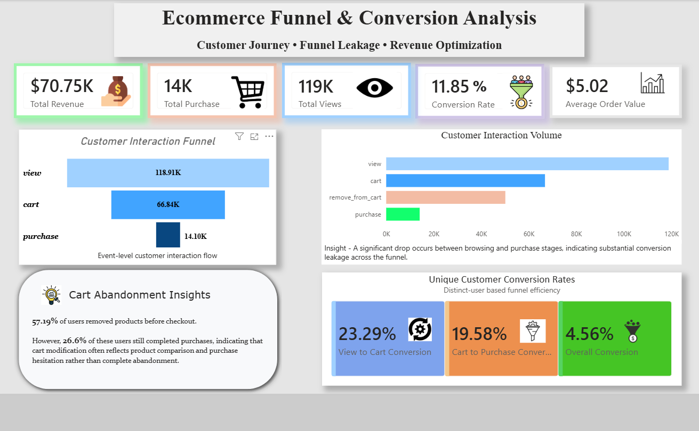
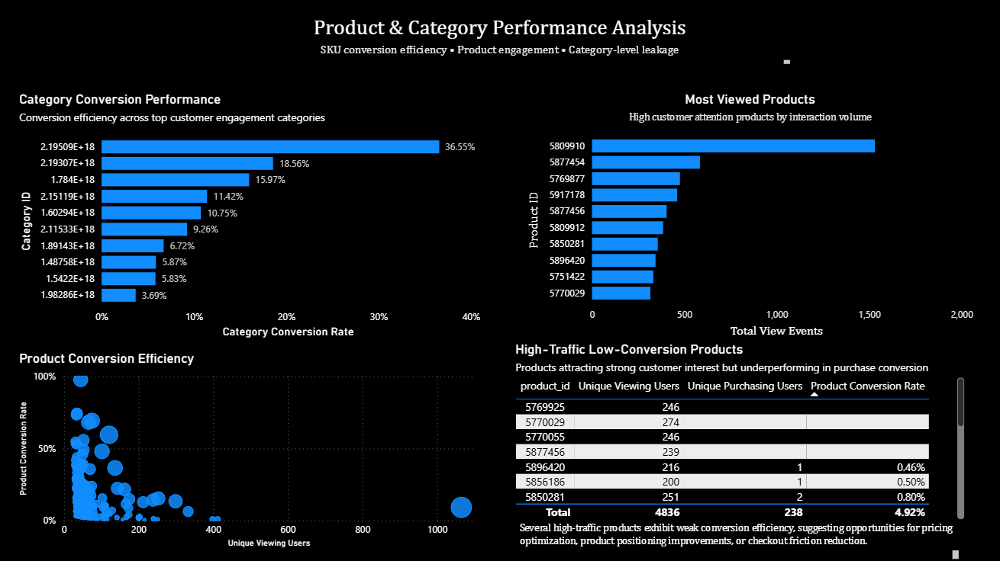

# Ecommerce Funnel & Conversion Analysis

## Project Overview
This project analyzes customer behavior across the ecommerce conversion funnel using SQL and Power BI.

The objective was to identify:
- funnel leakage points
- cart abandonment behavior
- product-level conversion inefficiencies
- category-level purchase performance
- session-level conversion trends

The analysis combines business problem-solving with data-driven insights to evaluate customer journey performance and revenue optimization opportunities.

---

## Tools & Technologies
- SQL
- Power BI
- Excel

---

## Dataset Overview
The dataset contains ecommerce customer interaction events including:
- product views
- cart additions
- remove-from-cart actions
- purchases
- user session behavior

The analysis was conducted at:
- user level
- session level
- product level
- category level

---

## Business Questions Solved

### Funnel Analysis
- Where do users drop off in the conversion funnel?
- What is the overall purchase conversion rate?

### Cart Abandonment Analysis
- How severe is cart abandonment behavior?
- How many users remove products before checkout?

### Product Performance Analysis
- Which products attract high traffic but fail to convert?
- Which SKUs demonstrate strong conversion efficiency?

### Category Analysis
- Which categories show highest purchase intent?
- Which categories underperform in conversion?

### Session Analysis
- How effectively do sessions progress from view → cart → purchase?

### Strict Funnel Validation
- How many sessions follow the correct sequential conversion path?

---

## Key Insights
- Significant customer drop-off observed between browsing and purchase stages
- More than half of cart users removed products before checkout
- Several high-traffic products showed weak conversion performance
- Certain product categories demonstrated stronger purchase intent than others
- Funnel sequencing analysis revealed checkout-stage friction affecting conversions

---

## Dashboard Preview

### Funnel & Conversion Dashboard


### Product & Category Performance Dashboard


---

## SQL Analysis Covered
- Dataset overview metrics
- Funnel conversion analysis
- Cart abandonment analysis
- Product conversion diagnostics
- Category-level conversion benchmarking
- Session-level funnel analysis
- Strict funnel validation

---

## Project Structure

```text
ecommerce-funnel-analysis
│
├── ecommerce_funnel_analysis.pbix
├── dashboard1.png
├── dashboard2.png
├── README.md
│
└── sql
    ├── 01_platform_overview.sql
    ├── 02_funnel_analysis.sql
    ├── 03_cart_abandonment.sql
    ├── 04_product_conversion.sql
    ├── 05_category_analysis.sql
    ├── 06_session_analysis.sql
    └── 07_strict_funnel.sql
```
## Business Recommendations
- Optimize checkout flow to reduce cart abandonment and improve purchase completion rates
- Improve product page experience for high-traffic low-conversion products
- Introduce personalized remarketing campaigns for users dropping off after cart addition
- Prioritize high-converting product categories in promotions and ad spend allocation
- Monitor funnel leakage continuously using dashboard-based KPI tracking
---

## Business Impact
This analysis highlights potential revenue leakage across the ecommerce funnel and identifies optimization opportunities related to product conversion, checkout friction, and customer purchase behavior.

---

## Files Included
- Power BI dashboard
- SQL analysis scripts
- Dashboard screenshots

---

## Author
**MD FAIZAN ALI**

LinkedIn: https://www.linkedin.com/in/md-faizan-ali-31032001business

GitHub: https://github.com/faizanali00786
